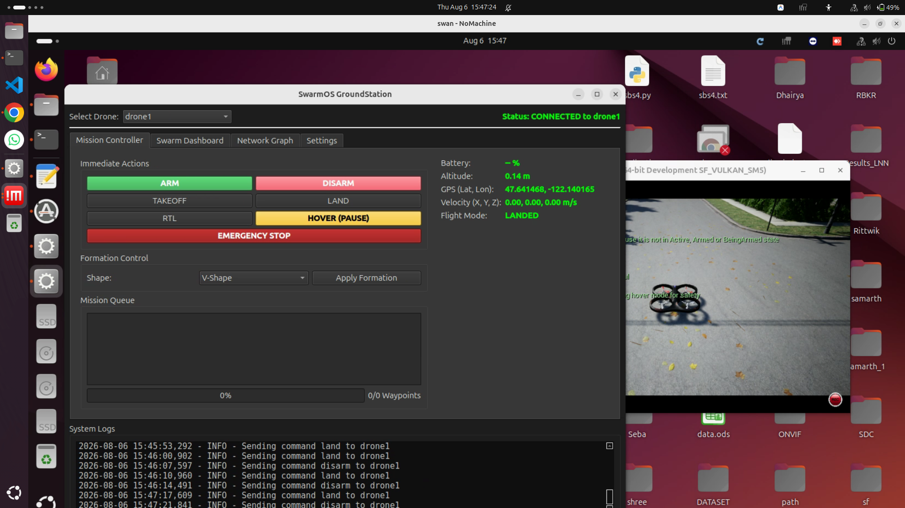
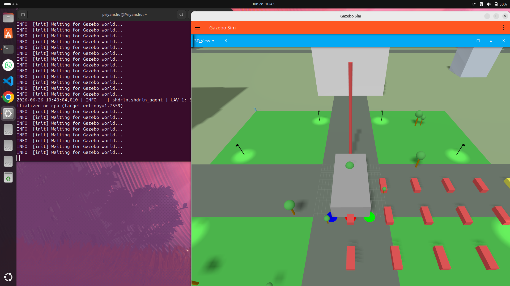
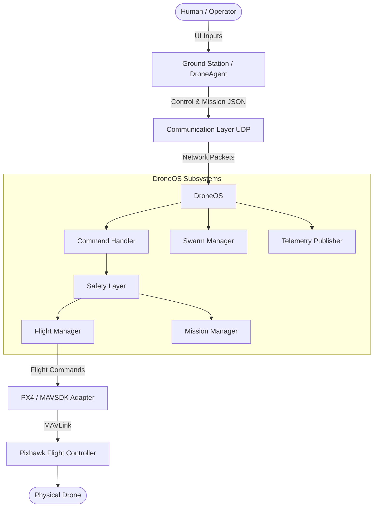
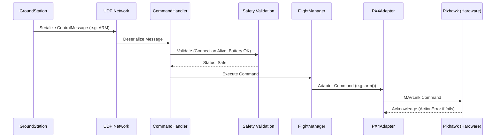
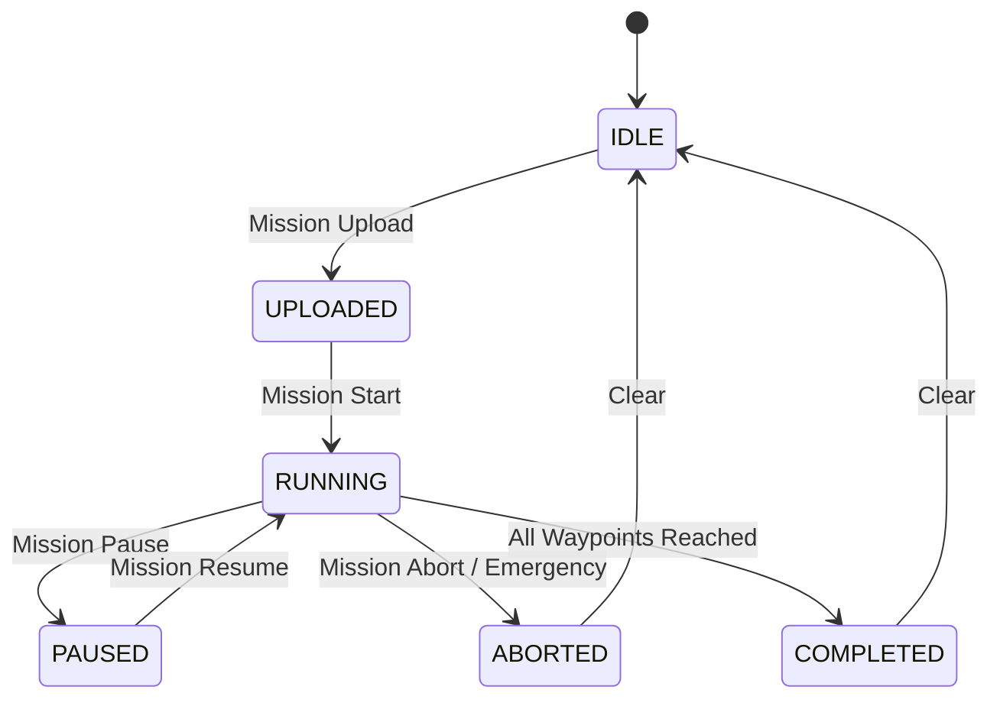

# SwarmOS

**Autonomous Drone Operating System for Intelligent Flight, Mission, Telemetry and Swarm Coordination**

## 1. Project Overview

SwarmOS is an advanced, distributed autonomous drone operating and control software platform built for real-world, multi-agent drone operations. It is designed to bridge the crucial gap between **high-level mission intelligence** (swarm logic, dynamic routing, decision making) and **low-level flight execution** (motor control, real-time stability).

## Screenshots

| Dashboard | Simulation |
|---|---|
|  |  |

By actively decoupling intelligent swarm behaviors from the physical flight controller, SwarmOS introduces a **safety-first, hardware-agnostic architecture**. It leverages native hardware capabilities (such as Pixhawk/PX4) for robust flight stability, while running an asynchronous, high-performance network layer on companion computers (like a Raspberry Pi). This ensures that complex commands and multi-drone coordination logic are safely intercepted, validated, and managed before ever reaching the physical hardware.

## 2. Core Architecture

SwarmOS utilizes a clear separation of concerns, routing human or autonomous commands through a network layer, into a safety-checked OS environment, and finally to the flight controller.

### Documentation & Manuals
- [SwarmOS Deployment Manual](assets/documents/swarmos-deployment-manual.pdf)



## 3. Repository Structure

```text
SwarmOS/
├── README.md                 # Project documentation
├── .gitignore                # Git ignore configuration
├── DroneOS/                  # The on-board drone operating system
│   ├── adapters/             # Hardware abstraction layer (PX4, AirSim)
│   ├── configs/              # YAML configuration files
│   ├── core/                 # Core flight, safety, mission, and swarm logic
│   ├── deploy/               # Deployment scripts and artifacts
│   ├── sensors/              # Battery, health, and auxiliary sensor monitoring
│   ├── shared/               # Shared protocols, networking, and message definitions
│   └── tests/                # Unit and integration tests for DroneOS
└── GroundStation/            # The command and control center
    ├── configs/              # GroundStation YAML configuration
    ├── core/                 # GroundStation core networking and state managers
    ├── missions/             # Mission storage and parsing
    ├── shared/               # Shared protocols (symlinked/copied from DroneOS)
    ├── tests/                # Tests for GroundStation
    └── ui/                   # PySide6 UI panels and dashboards
```

## 4. System Components

### DroneOS
DroneOS runs on the drone's companion computer (e.g., Raspberry Pi) and acts as the brain of the drone.
- **Flight Controller Adapter**: Translates high-level actions into hardware-specific API calls (e.g., MAVSDK for PX4, or AirSim for simulation).
- **Command Handler**: Receives and routes incoming network commands to appropriate subsystems.
- **Flight Manager**: Manages basic flight behaviors (Arm, Disarm, Takeoff, Land, RTL, Move).
- **Safety System**: Enforces connection timeouts, battery critical levels, and emergency stops before any flight action.
- **Mission Manager**: Handles the storage, progression, and execution of complex multi-waypoint missions.
- **Telemetry Publisher**: Streams real-time flight data at configured intervals to the swarm and ground station.
- **Diagnostics / Health Monitoring**: Continuously monitors the health of the connection and onboard systems.
- **Battery Monitoring**: Tracks voltage and percentage, triggering hardware failsafes if thresholds are breached.
- **Swarm Management**: Manages peer discovery and heartbeats for multi-drone operations.
- **Collision Avoidance**: A standard collision avoidance subsystem built into the decision engine.
- **Decision Engine**: Periodically evaluates telemetry and swarm state to make autonomous movement decisions.

### GroundStation (DroneAgent)
The GroundStation serves as the central command, control, and visualization interface for human operators.
- Sends network commands to single or multiple drones.
- Receives and plots telemetry data on maps.
- Uploads, starts, pauses, and monitors complex missions.
- Visualizes network topology and swarm health.

## 5. Flight Controller Integration

SwarmOS uses the **Adapter Pattern** to interface with flight controllers. The primary implemented integration is the `PX4Adapter` utilizing **MAVSDK**.

- **Connection**: Supports dynamic auto-discovery of Pixhawk hardware via USB serial (`/dev/serial/by-id/`, `/dev/ttyACM*`, `/dev/ttyUSB*`) or user-configured connections.
- **Telemetry Streams**: Subscribes asynchronously to position, velocity, attitude, battery, GPS info, armed state, and flight mode.
- **Flight Commands**: Translates core actions into `mavsdk.action` and `mavsdk.offboard` commands.
- **Safety Authority**: SwarmOS respects the native flight-controller safety authority. `MAVSDK ActionError`s resulting from failed Pixhawk pre-arm checks are caught and propagated. SwarmOS does not bypass Pixhawk's native safety mechanisms.

## 6. Command Pipeline

Commands flow through a strict, serialized pipeline ensuring that only valid, safe actions reach the hardware.



**Supported Commands**: `ARM`, `DISARM`, `TAKEOFF`, `LAND`, `RTL`, `HOVER`, `MOVE`, `FORMATION_UPDATE`.

## 7. Safety Architecture

Safety is paramount and handled in two complementary layers:

**SwarmOS Software Safety Gates**:
- **Connection Heartbeats**: A loss of heartbeat triggers an automatic RTL.
- **Battery Failsafes**: Low battery triggers RTL; critical battery triggers immediate landing.
- **Emergency Stop**: Software e-stop forces velocity to zero, disarms, and aborts any active mission.
- **Command Validation**: Invalid or malformed commands are dropped.

**Hardware Safety Gates**:
- Software safety gates do not replace the Pixhawk flight controller's native safety mechanisms. Pre-arm checks, GPS requirements, and hardware EKFs are actively respected by the `PX4Adapter`.

## 8. ARM / TAKEOFF Safety Workflow

SwarmOS implements a strict distinction between Arming and Taking off:

- **ARM**:
  Operator → `ARM` command → DroneOS Command Handler → FlightManager → PX4Adapter → MAVSDK → Pixhawk evaluates native pre-arm checks → Physical arm confirmation → Telemetry updates `armed_state` to `ARMED`.
- **TAKEOFF**:
  Operator → `TAKEOFF` command → DroneOS Command Handler → FlightManager → PX4Adapter sets takeoff altitude → MAVSDK → Pixhawk.
  *Note: Taking off implicitly requires the drone to be armed first, which is enforced by the hardware.*

## 9. Telemetry Pipeline

Telemetry is continuously streamed from the flight controller to the network.

**Pipeline**:
Pixhawk/PX4 → MAVSDK telemetry streams → PX4Adapter → `TelemetryData` object → TelemetryPublisher → JsonSerializer → UDP → Ground Station & Swarm Peers.

**Supported Telemetry Fields**:
- Latitude, Longitude, Absolute Altitude
- Velocity (X, Y, Z / NED) and Ground Speed
- Attitude (Pitch, Roll, Yaw) and Heading (0-360)
- Battery Level (%) and Voltage (V)
- GPS Validity (FIX_2D, FIX_3D, RTK, etc.)
- Flight Mode
- Armed State (ARMED/DISARMED)
- Mission State and Future Intent

## 10. Mission System

SwarmOS supports an advanced distributed mission workflow via specific message types:
- **Mission Upload**: JSON-based mission plans are transmitted to the drone and stored locally.
- **Mission Start/Stop/Pause/Resume**: Operators can control execution states dynamically.
- **Mission Status**: Drones report mission progress (current waypoint, percent complete).
- **Mission Management**: Operators can Abort, Delete, Duplicate, or Clear missions.



*Note: Uploading a mission does not automatically arm or takeoff the drone. Operators must issue explicit ARM and TAKEOFF commands prior to mission execution.*

## 11. Swarm System

SwarmOS is built for multi-drone coordination:
- **Peer Discovery**: Drones broadcast `DroneJoinMessage` and maintain a registry of active peers via `SwarmMembership`.
- **Swarm Heartbeats**: Drones monitor each other's presence. Stale connections are pruned.
- **Shared Telemetry**: Drones exchange `SwarmStateMessage` and `TelemetryMessage` to maintain situational awareness.
- **Decision Engine**: `LocalDecisionEngine` evaluates peer telemetry alongside standard collision avoidance to dictate safe autonomous movement.

## 12. Ground Station

The PySide6-based GroundStation provides a comprehensive UI:
- **Flight Control Panel**: Buttons for Arm, Disarm, Takeoff, Land, and RTL.
- **Map Panel**: Real-time GPS plotting of drones.
- **Telemetry Panel**: Live readouts of altitude, speed, battery, and attitude.
- **Mission System UI & Controller**: Tools to plan, upload, and monitor missions.
- **Multi-Drone UI & Swarm Dashboard**: Manage fleets, view active drones, and monitor formation status.
- **Network Graph**: Visualizes connection topology.
- **Diagnostics & Settings**: Health monitoring and configuration.
- **Keyboard Controls**: Manual override keyboard piloting.

## 13. Communication Architecture

SwarmOS uses a fast, lightweight asynchronous UDP stack:
- **Transport**: UDP broadcast and peer-to-peer messaging.
- **Serialization**: JSON-based serialization via `pydantic` schemas.
- **Message Types**: Strictly typed messages including `ControlMessage`, `TelemetryMessage`, `HeartbeatMessage`, `MissionMessage` variants, `EmergencyMessage`, and `SwarmStateMessage`.

## 14. Error Handling

- **Pydantic Validation**: All incoming network messages are validated strictly. Malformed packets are logged and dropped.
- **Hardware Rejections**: `mavsdk.action.ActionError` exceptions (e.g., taking off without GPS) are caught, logged as critical errors, and gracefully prevented from crashing the system.
- **Stale Telemetry**: If telemetry subscriptions hang or fail, the `HealthMonitor` evaluates system freshness and can trigger failsafes.

## 15. Configuration

Configuration is managed via structured YAML files located in `DroneOS/configs/` and `GroundStation/configs/`:
- `drone.yaml`: Drone ID and physical properties.
- `network.yaml`: Ports, broadcast addresses, and heartbeat intervals.
- `flight.yaml`: PX4 connection strings (`px4_connection_string`) and altitude limits.
- `mission.yaml` / `groundstation.yaml`: UI and storage settings.

*Users should adjust YAML files for environment-specific parameters. Avoid hard-coding credentials.*

## 16. Installation

For a fresh Ubuntu/Linux setup:

```bash
# Clone the repository
git clone git@github.com:Priyanshu0209/SwarmOS.git
cd SwarmOS

# Create and activate a Python virtual environment
python3 -m venv venv
source venv/bin/activate

# Install DroneOS requirements
pip install -r DroneOS/requirements.txt

# Install GroundStation requirements
pip install -r GroundStation/requirements.txt
```

## 17. Running the System

Ensure your virtual environment is active.

**Running DroneOS**:
```bash
python -m DroneOS.main
```
*Successful startup will show connection attempts to the Pixhawk, starting of background sensors, and the telemetry publisher loop.*

**Running GroundStation**:
```bash
python -m GroundStation.main
```
*This will launch the PySide6 UI.*

## 18. Hardware Setup

- **Companion Computer**: Raspberry Pi or similar Linux SBC.
- **Flight Controller**: Pixhawk running PX4 firmware.
- **Connection**: USB cable linking the companion computer to the Pixhawk. SwarmOS will automatically attempt to discover the Pixhawk on `/dev/serial/by-id/`, `/dev/ttyACM*`, or `/dev/ttyUSB*`.

## 19. ⚠️ SAFETY WARNING

- **Remove propellers** during all software, networking, and hardware integration testing.
- **Never test autonomous flight in unsafe areas.** Obey all local aviation regulations.
- **Verify Pixhawk failsafes** are configured correctly in QGroundControl before using SwarmOS.
- **Test ARM/DISARM mechanisms** thoroughly before attempting a TAKEOFF.
- **Verify telemetry** is updating smoothly on the GroundStation before flight.
- **Never attempt to bypass flight-controller safety checks.** SwarmOS is an intelligence layer, not a replacement for a certified flight controller.

## 20. Testing

SwarmOS contains testing suites for both major components:
- `DroneOS/tests/`: Static logic and adapter unit tests.
- `GroundStation/tests/`: UI and network manager tests.

*Tests validating physical flight logic should only be considered passed after verified hardware-in-the-loop (HITL) or real-flight validation.*

## 21. Current Status

| Component | Status |
|---|---|
| DroneOS Architecture | Implemented |
| PX4/MAVSDK Integration | Implemented |
| Telemetry Pipeline | Implemented |
| Flight Commands | Implemented |
| Mission System | Implemented |
| GroundStation UI | Implemented |
| Swarm Communication | Implemented |
| Hardware Validation | Requires Physical Testing |

## 22. Known Limitations

- Real-flight swarm behavior requires physical validation and tuning.
- Offboard movement (velocity control) commands require robust PX4 GPS lock and real-world validation.
- GPS data is generally unavailable indoors, which may prevent ARM/TAKEOFF without proper PX4 parameter overrides.

## 23. Development Principles

- **Separation of Concerns**: Ground UI, Networking, OS logic, and Hardware drivers are isolated.
- **Adapter Pattern**: The `IFlightController` interface ensures DroneOS can swap out PX4 for AirSim seamlessly.
- **Dependency Injection**: Subsystems (e.g., SafetyModule, FlightManager) are injected into the CommandHandler.
- **Safety-First**: Safety modules monitor parallel states and can preempt commands.

## 24. Future Roadmap

- **Planned**: Integration of advanced visual odometry or RTK GPS for precision swarm formations.
- **Planned**: Decentralized leaderless consensus algorithms for swarm obstacle avoidance.
- **Planned**: Video stream integration into the GroundStation.

## 25. Contributing

1. Fork the repository
2. Create your feature branch (`git checkout -b feature/AmazingFeature`)
3. Make your changes and run tests
4. Commit your changes (`git commit -m 'Add some AmazingFeature'`)
5. Push to the branch (`git push origin feature/AmazingFeature`)
6. Open a Pull Request

*Do not commit `venv/`, `__pycache__/`, `*.pyc`, or local configurations containing private network details.*

## 26. License

Distributed under the MIT License. See `LICENSE` for more information.

## 27. Author / Repository

Repository: [https://github.com/Priyanshu0209/SwarmOS](https://github.com/Priyanshu0209/SwarmOS)
